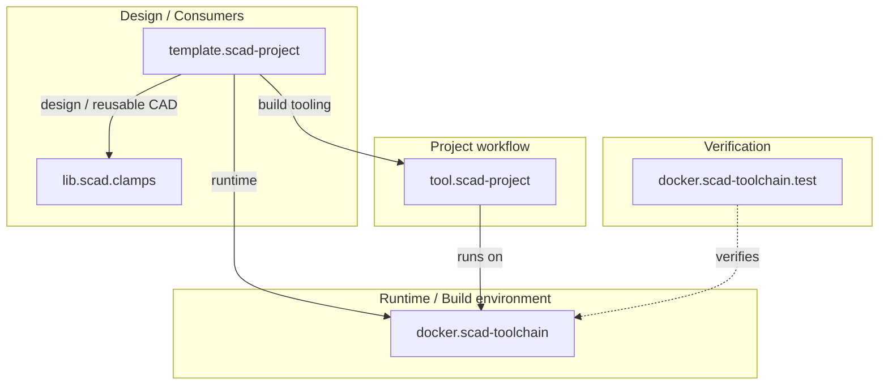

# meta.scad-projects

Central architecture, repository map, integration context and cross-project
documentation for the SCAD project ecosystem.

This repository is the overkoepelende source of truth for the relationships
between the repositories that make up the SCAD tooling and library workflow.

## Scope

The repository documents and integrates:

- `docker.scad-toolchain`
- `docker.scad-toolchain.test`
- `tool.scad-project`
- `template.scad-project`
- `lib.scad.clamps`

The individual repositories remain independently versioned and own their own
implementation details. This repository documents how they fit together.

## Tracked repositories

| Repository | Role |
| --- | --- |
| [`docker.scad-toolchain`](https://github.com/brainboxemb/docker.scad-toolchain) | Runtime / build environment |
| [`docker.scad-toolchain.test`](https://github.com/brainboxemb/docker.scad-toolchain.test) | Verification of the runtime/toolchain |
| [`tool.scad-project`](https://github.com/brainboxemb/tool.scad-project) | Reusable project and build tooling |
| [`template.scad-project`](https://github.com/brainboxemb/template.scad-project) | Reference consumer project |
| [`lib.scad.clamps`](https://github.com/brainboxemb/lib.scad.clamps) | Reusable CAD library |

The current generated overview of pinned commits, latest default-branch commits,
tags and GitHub Actions state is published on the generated `build` branch:

[Repository status](https://github.com/brainboxemb/meta.scad-projects/blob/build/repository-status.md)

## Repository roles



See [docs/architecture.md](docs/architecture.md) for the full ecosystem view.

## Source and generated content

The architecture follows the same source/build separation used by the project
tooling:

```text
main
    architecture source
    Markdown
    Mermaid diagrams
    repository metadata
    submodule pointers

build
    generated diagrams
    generated reports
    generated cross-project documentation
```

Generated files should not be committed to the normal source branch unless they
are intentionally maintained source assets.

## Repository layout

```text
meta.scad-projects/
├── repos/                  # Git submodules
├── docs/
│   ├── architecture.md
│   ├── repository-map.md
│   ├── build-model.md
│   └── versioning.md
├── design/
│   └── design.md
├── bootstrap.ps1
├── bootstrap.sh
├── .gitmodules
├── README.md
└── CHATGPT.md
```

## Bootstrap

The ZIP cannot contain real Git submodule gitlinks. After creating the actual
Git repository, run the bootstrap script to register and initialize the
repositories listed in `.gitmodules`.

Windows:

```powershell
.\bootstrap.ps1
```

Linux/macOS:

```bash
bash ./bootstrap.sh
```

The bootstrap scripts require only Git plus PowerShell or bash.


## Automated ecosystem status

`.github/workflows/repository-status.yml` generates a current cross-repository
status report:

```text
bld/
├── repository-status.md
└── repository-status.mmd
```

It runs:

- after a push to `main`;
- once per day at `05:17 UTC`;
- on manual `workflow_dispatch`.

The report includes:

- commit pinned by this meta repository;
- remote default branch;
- latest default-branch commit;
- newest Git tag by creator date;
- whether the pinned commit is current;
- latest completed GitHub Actions result;
- latest commit date;
- a version-labelled Mermaid architecture diagram.

The generated output is published to the mutable orphan `build` branch. Nothing
generated by this workflow is committed to `main`.

## Update all repositories

After bootstrap, the meta repository keeps exact Git submodule commits pinned.
To intentionally move all tracked repositories to the latest commit on their
remote default branch, run:

Windows:

```powershell
.\update-repos.ps1
```

Linux/macOS:

```bash
bash ./update-repos.sh
```

The update script:

- initializes missing submodules first;
- refuses to update a repository that has local changes;
- fetches and prunes `origin`;
- follows each repository's `origin/HEAD` default branch instead of assuming
  that every repository uses `main`;
- updates with `pull --ff-only`;
- prints old and new commit SHAs;
- leaves the changed submodule pointers uncommitted in `meta.scad-projects`.

This keeps the actions separate:

```text
bootstrap
    restore the versions pinned by meta.scad-projects

update-repos
    intentionally advance the tracked repositories

git commit
    accept the new ecosystem snapshot
```

A typical update therefore ends with:

```powershell
git status
git add repos
git commit -m "Update SCAD ecosystem repositories"
```

## Current status

This early version is intentionally small. It establishes the architecture,
repository map, design documentation and submodule/bootstrap model.

Cross-repository release orchestration and automated compatibility checks can be
added later, after the documentation model has proven useful.

The model, code and documentation are being developed with the assistance of
ChatGPT.
