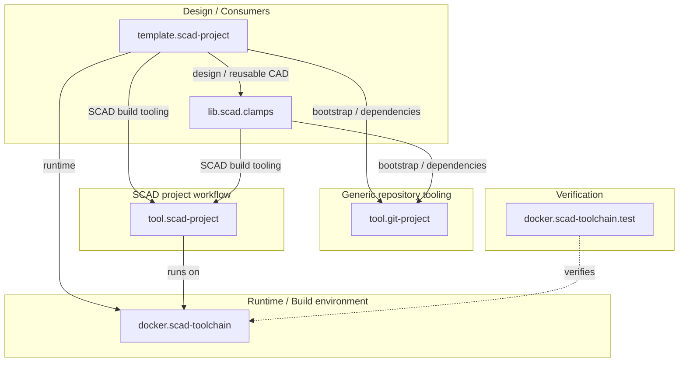

# meta.scad-projects

Central architecture, repository map, integration context and cross-project
documentation for the current SCAD project ecosystem.

This repository is the coordination source of truth for the relationships and
rollout rules that make up the **current** SCAD tooling and library workflow.
The wider SCAD/CAD landscape, including classic project generations, is
cataloged separately by [`tech.scad`](https://github.com/brainboxemb/tech.scad).

## Scope

The controlled integration set documents and observes:

- `tool.git-project` — generic Git bootstrap/dependency tooling;
- `docker.scad-toolchain`;
- `docker.scad-toolchain.test`;
- `tool.scad-project` — SCAD-specific project/build tooling;
- `template.scad-project`;
- `lib.scad.clamps`.

The individual repositories remain independently versioned and own their own
implementation details. This repository documents how they fit together.

Do not infer from this list that every CAD repository uses the same stack. Use
`tech.scad/catalog.yml` for the broad project-infrastructure classification.

## Tracked repositories

| Repository | Role |
| --- | --- |
| [`tool.git-project`](https://github.com/brainboxemb/tool.git-project) | Generic Git bootstrap and dependency/submodule management |
| [`docker.scad-toolchain`](https://github.com/brainboxemb/docker.scad-toolchain) | Runtime / build environment |
| [`docker.scad-toolchain.test`](https://github.com/brainboxemb/docker.scad-toolchain.test) | Verification of the runtime/toolchain |
| [`tool.scad-project`](https://github.com/brainboxemb/tool.scad-project) | Reusable SCAD project and build tooling |
| [`template.scad-project`](https://github.com/brainboxemb/template.scad-project) | Reference current-generation consumer project |
| [`lib.scad.clamps`](https://github.com/brainboxemb/lib.scad.clamps) | Reusable CAD library / current-generation consumer |

The generated overview of pinned commits, latest default-branch commits, tags
and GitHub Actions state is published on the generated `build` branch:

[Repository status](https://github.com/brainboxemb/meta.scad-projects/blob/build/repository-status.md)

## Repository roles



The `tool.git-project` arrows represent the target ownership boundary introduced
by the current migration prerequisite. An individual repository is only
considered migrated after its own configuration and gitlinks prove adoption.

See [docs/architecture.md](docs/architecture.md) for the full ecosystem view.

## Active cross-project improvement plan

The current tooling/build improvement track is documented in four useful entry
points:

- [SCAD ecosystem architecture](docs/architecture.md) — current repository
  boundaries, including the generic `tool.git-project` bootstrap layer;
- [Current SCAD project workflow model](docs/project-workflow-model.md) — the
  as-is build/render/design/verification model;
- [Tooling build-decision and verification plan](docs/tooling-test-plan.md) —
  the numbered roadmap. Step **0.5 — Adopt generic Git bootstrap layer** is a
  prerequisite before Structured build-decision telemetry resumes;
- [New chat / work-session handoff](docs/new-chat-handoff.md) — the copy/paste
  instruction for a new ChatGPT work session, including the requirement to
  re-check architecture/ownership before implementing a step.

The plan is intentionally split into bounded steps so a new work session can
start from this meta repository and continue in the repository that owns the
implementation.

## Current ownership split

The generic bootstrap concern is now separate from SCAD-specific build tooling:

```text
tool.git-project
    generic bootstrap
    generic dependency/submodule registration
    generic status/update behavior

tool.scad-project
    SCAD configuration/build/design/verification
    SCons orchestration
    reusable SCAD GitHub Actions workflows
```

Current-generation consumers are being migrated to that split. New generic
Git/submodule behavior should not be added back into `tool.scad-project`.

## Target project dependency model

The target current-generation project model is:

```text
tools/tool.git-project
    bootstrap engine pinned directly by the parent Git repository

project.yml
    generic project/dependency/profile declarations

project.scad.yml (or migration-compatible SCAD profile)
    SCAD-specific project/build configuration

managed dependency gitlinks
    exact resolved commits

tools/tool.scad-project
    SCAD tooling dependency managed by the generic layer
```

The bootstrap engine itself is special: it must exist before `project.yml` can
be processed, so a tiny root launcher restores its committed gitlink and then
delegates to `tool.git-project`.

Generic dependency operations remain intentionally separate:

```text
bootstrap
    establish/repair configured dependency registrations and committed locks

status
    inspect dependency state without advancing it

update
    intentionally resolve configured refs and advance locks
```

SCAD build/design/verification commands remain in `tool.scad-project`.

## Migration scope

Not all CAD projects use the current infrastructure.

For broad current-stack migrations, consult
[`tech.scad/catalog.yml`](https://github.com/brainboxemb/tech.scad/blob/main/catalog.yml)
and consider repositories classified as:

```yaml
project_infrastructure:
  generation: current
```

Classic standalone projects and projects using `brainboxemb.github.actions` are
outside the generic migration unless a separate project-specific decision
explicitly includes them.

`meta.scad-projects` coordinates a smaller controlled integration/rollout set;
it does not replace the complete catalog.

## Source and generated content

The architecture follows the same source/build separation used by the project
tooling:

```text
main
    architecture source
    Markdown
    Mermaid diagrams
    repository metadata
    submodule pointers

build
    generated diagrams
    generated reports
    generated cross-project documentation
```

Generated files should not be committed to the normal source branch unless they
are intentionally maintained source assets.

## Repository layout

```text
meta.scad-projects/
├── repos/                  # Git submodules in the controlled integration set
├── docs/
│   ├── architecture.md
│   ├── repository-map.md
│   ├── build-model.md
│   ├── project-workflow-model.md
│   ├── tooling-test-plan.md
│   ├── new-chat-handoff.md
│   └── versioning.md
├── design/
│   └── design.md
├── bootstrap.ps1
├── bootstrap.sh
├── .gitmodules
├── README.md
└── AGENTS.md
```

## Meta bootstrap

This repository's own root bootstrap scripts restore the first-level integration
submodules pinned by `meta.scad-projects`. That is a repository-local mechanism
for the meta integration checkout; it should not be confused with the target
consumer architecture owned by `tool.git-project`.

Windows:

```powershell
.\bootstrap.ps1
```

Linux/macOS:

```bash
bash ./bootstrap.sh
```

## Direct-submodule rule

The ecosystem uses a consistent direct-only checkout rule.

```text
normal project/repository operation
    initialize only direct submodules owned by that repository

dependency consumed inside another repository
    do not automatically initialize that dependency's own development submodules

full recursive checkout
    only in an explicit integration test
```

For `meta.scad-projects`, normal bootstrap, validation and status workflows
materialize only `repos/*`. Nested tooling/libraries inside those repositories
are intentionally left untouched.

## Meta checkout depth

The normal meta workflows initialize only the first-level repositories under
`repos/`; they do not recursively materialize every consumer dependency tree.

This is intentional because `meta.scad-projects` observes and compares the
tracked repositories. A dedicated integration test may use deeper checkout when
its explicit purpose is to validate a complete consumer dependency tree.

## Automated ecosystem status

`.github/workflows/repository-status.yml` generates a current cross-repository
status report under `bld/` and publishes it to the mutable generated `build`
branch.

The report includes, where available:

- commit pinned by this meta repository;
- remote default branch;
- latest default-branch commit;
- latest stable semantic-version tag;
- whether the pinned commit is current;
- latest completed GitHub Actions result;
- latest commit date.

Nothing generated by this workflow is committed to `main`.

## Updating the controlled integration set

After bootstrap, the meta repository keeps exact Git submodule commits pinned.
`update-repos.ps1` / `update-repos.sh` intentionally advance those tracked
repositories and leave changed gitlinks uncommitted for review.

This keeps the actions separate:

```text
bootstrap
    restore the versions pinned by meta.scad-projects

update-repos
    intentionally advance the tracked repositories

git commit
    accept the new ecosystem snapshot
```

## Current status

The repository now records the separated generic Git bootstrap layer, the
current SCAD-specific project/build layer, the controlled integration set and
the prerequisite migration that must complete before build-decision telemetry
continues.

The model, code and documentation are being developed with the assistance of
ChatGPT.
