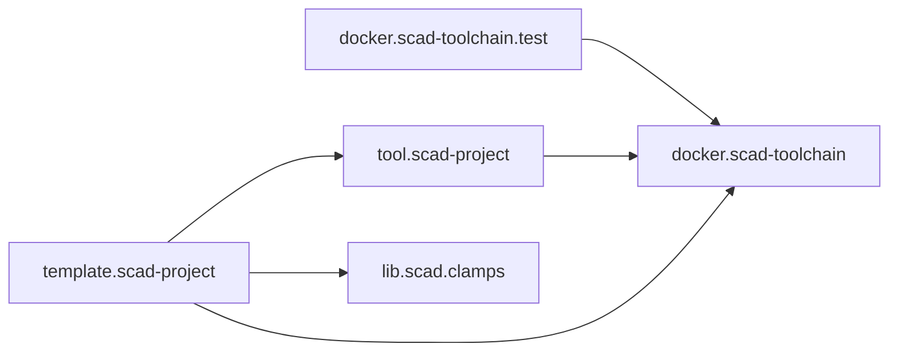

# meta.scad-projects

Central architecture, repository map, integration context and cross-project
documentation for the SCAD project ecosystem.

This repository is the overkoepelende source of truth for the relationships
between the repositories that make up the SCAD tooling and library workflow.

## Scope

The repository documents and integrates:

- `docker.scad-toolchain`
- `docker.scad-toolchain.test`
- `tool.scad-project`
- `template.scad-project`
- `lib.scad.clamps`

The individual repositories remain independently versioned and own their own
implementation details. This repository documents how they fit together.

## Repository roles



See [docs/architecture.md](docs/architecture.md) for the full ecosystem view.

## Source and generated content

The architecture follows the same source/build separation used by the project
tooling:

```text
main
    architecture source
    Markdown
    Mermaid diagrams
    repository metadata
    submodule pointers

build
    generated diagrams
    generated reports
    generated cross-project documentation
```

Generated files should not be committed to the normal source branch unless they
are intentionally maintained source assets.

## Repository layout

```text
meta.scad-projects/
├── repos/                  # Git submodules
├── docs/
│   ├── architecture.md
│   ├── repository-map.md
│   ├── build-model.md
│   └── versioning.md
├── design/
│   └── design.md
├── bootstrap.ps1
├── bootstrap.sh
├── .gitmodules
├── README.md
└── CHATGPT.md
```

## Bootstrap

The ZIP cannot contain real Git submodule gitlinks. After creating the actual
Git repository, run the bootstrap script to register and initialize the
repositories listed in `.gitmodules`.

Windows:

```powershell
.\bootstrap.ps1
```

Linux/macOS:

```bash
bash ./bootstrap.sh
```

The bootstrap scripts require only Git plus PowerShell or bash.

## Current status

This first version is intentionally small. It establishes the architecture,
repository map, design documentation and submodule/bootstrap model.

Cross-repository release orchestration and automated compatibility checks can be
added later, after the documentation model has proven useful.

The model, code and documentation are being developed with the assistance of
ChatGPT.
