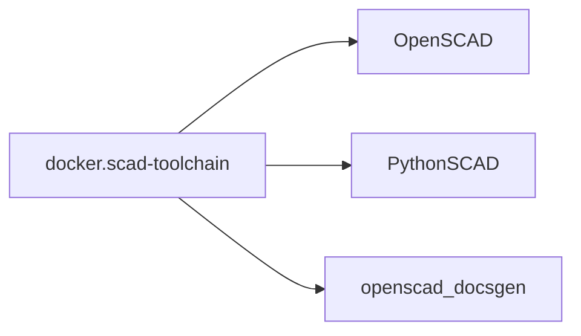
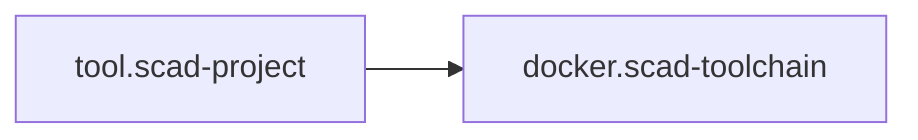
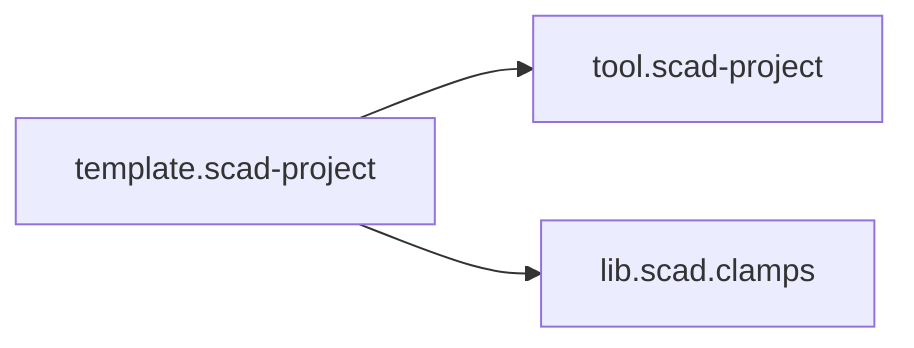
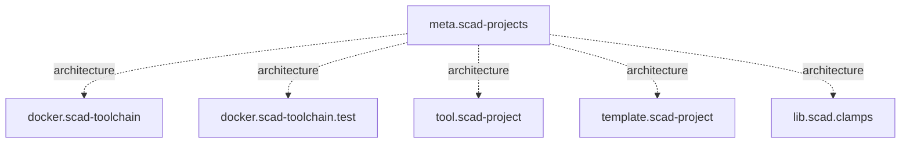

# SCAD ecosystem design

## Purpose

This document describes the ecosystem itself as a designed system.

The main design goal is to keep runtime, workflow policy, reusable geometry and
consumer projects independently maintainable while still making their
relationships explicit.

## 1. Runtime layer

`docker.scad-toolchain` provides the runtime environment.

## 2. Workflow layer

`tool.scad-project` provides reusable project behavior without becoming part of
the Docker image.

## 3. Consumer and library layer

Projects consume both tooling and reusable CAD libraries.

## 4. Integration layer

`meta.scad-projects` sits above the implementation repositories as an integration
and architecture repository.

It should not become a required dependency for normal builds.

## Design principles

1. Keep generated binaries off the normal source branch.
2. Keep external repositories pinned and reproducible.
3. Let each repository own its implementation details.
4. Put cross-repository decisions in this repository.
5. Prefer text-based diagrams such as Mermaid for architecture source.
6. Add automation only when it replaces repeated manual integration work.
