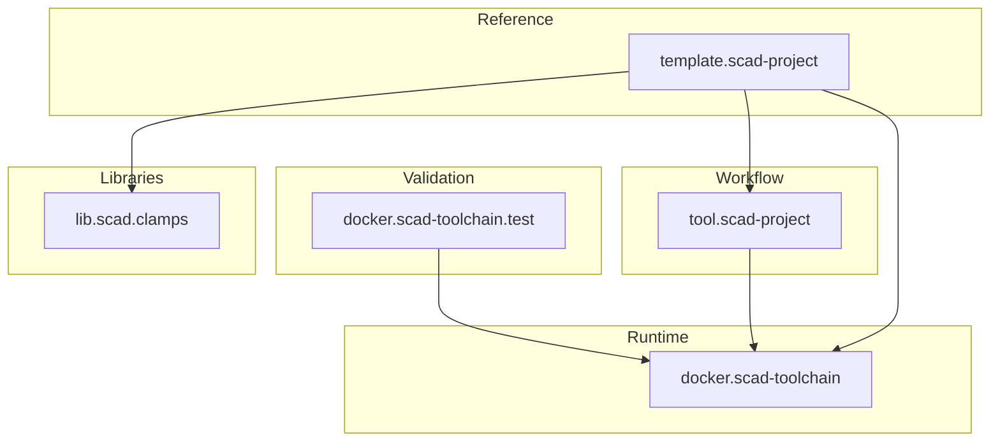
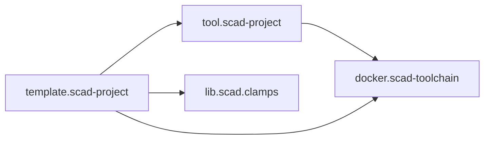

# SCAD ecosystem architecture

## Purpose

The SCAD ecosystem is split into multiple repositories because runtime,
workflow tooling, reusable CAD libraries and consumer projects evolve at
different rates.

This repository documents their relationships and the architectural rules that
apply across repository boundaries.

## Ecosystem overview

## Layer responsibilities

### docker.scad-toolchain

Runtime and external tooling only.

Examples:

- OpenSCAD
- PythonSCAD
- Python
- BOSL2
- pybosl2
- `openscad_docsgen`
- rendering/runtime dependencies

The image should not contain project-specific workflow policy.

### docker.scad-toolchain.test

Consumer-style smoke and interoperability tests for the runtime image.

It validates that the capabilities advertised by the toolchain actually work
from an external repository.

### tool.scad-project

Reusable project workflow and policy.

Examples:

- configuration linting
- external dependency management
- OpenSCAD docs linting
- design documentation generation
- build orchestration
- verification
- generated build publication

This layer consumes the runtime supplied by `docker.scad-toolchain`.

### template.scad-project

Reference consumer and executable example of the recommended project layout.

It demonstrates:

- `dsg`, `bld`, `vrf`
- pinned tooling as a Git submodule
- reusable external CAD libraries
- design documentation
- CI build and verification
- generated build branch

### lib.scad.clamps

Reusable OpenSCAD/PythonSCAD library.

The library owns its public API and design source. Generated design images and
reports belong on its generated build branch rather than the normal source
branch.

## Dependency direction

Dependencies should remain one-directional where possible:

The meta repository observes and integrates these repositories but should not
become a required runtime dependency of them.

## Architecture rule

The meta repository is a coordination and integration layer, not a place to move
implementation details out of their owning repositories.

Individual repositories remain authoritative for:

- their source code
- their tests
- their own design source
- their releases/tags

`meta.scad-projects` is authoritative for:

- ecosystem architecture
- repository relationships
- supported version combinations
- cross-project conventions
- integration-level documentation
