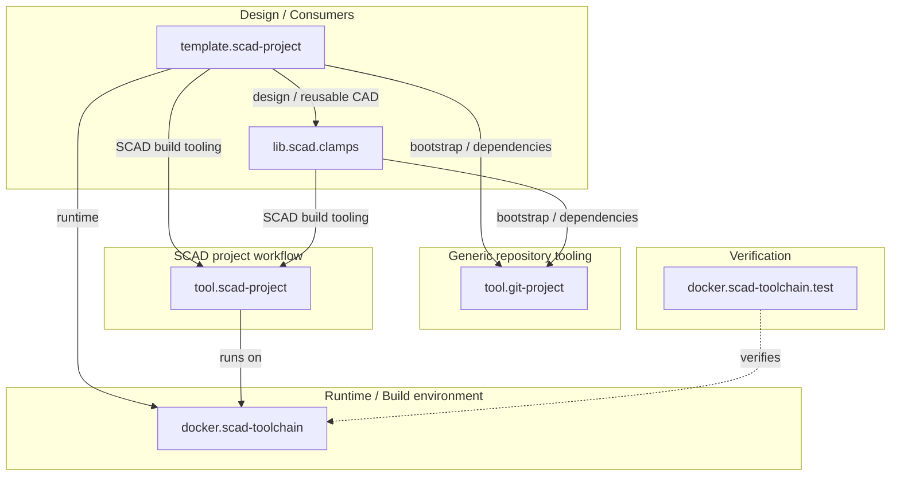
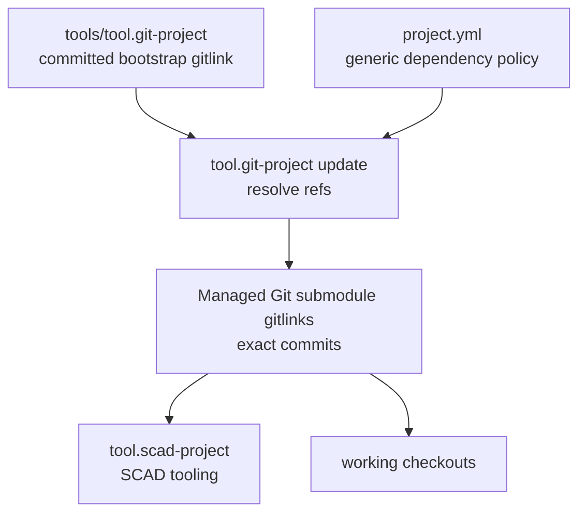
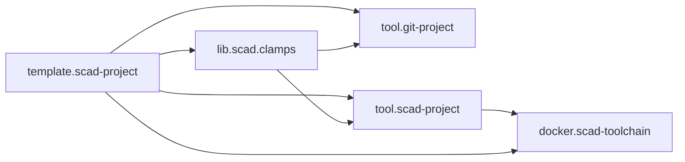

# SCAD ecosystem architecture

## Purpose

The SCAD ecosystem is split into multiple repositories because generic
repository bootstrap, runtime, SCAD workflow tooling, reusable CAD libraries and
consumer projects evolve at different rates.

This repository documents their relationships and the architectural rules that
apply across repository boundaries.

For the wider inventory of classic and current CAD projects, use
`tech.scad/catalog.yml`. This repository deliberately maintains only the
controlled current integration set.

## Ecosystem overview



The arrows to `tool.git-project` describe the target current-generation
ownership boundary. Individual consumers are only considered migrated after
their own configuration/gitlinks adopt that layer.

### Relationship semantics

The direction of a solid arrow means **"A uses B"**.

Examples:

- `template.scad-project -> tool.git-project`: the current-generation target
  architecture uses the generic Git tool for bootstrap and dependency handling.
- `template.scad-project -> tool.scad-project`: the template uses the reusable
  SCAD project workflow for build/design/verification tooling.
- `template.scad-project -> docker.scad-toolchain`: the template build runs in
  the SCAD runtime/build environment.
- `template.scad-project -> lib.scad.clamps`: the template consumes the
  reusable clamp library as design/CAD input.
- `tool.scad-project -> docker.scad-toolchain`: the SCAD project workflow runs
  on capabilities provided by the runtime image.

A dashed arrow is a verification relationship:

- `docker.scad-toolchain.test -.-> docker.scad-toolchain`: the test repository
  verifies the runtime/toolchain rather than consuming it as an application
  dependency.

## Layer responsibilities

### tool.git-project

Generic repository/bootstrap and dependency management shared across project
types.

Examples:

- restoring the committed bootstrap-tool gitlink;
- validating generic `project.yml` dependency/profile declarations;
- registering and initializing managed Git submodules;
- aligning dependencies to configured refs;
- reporting dependency status;
- explicit dependency updates;
- protecting dirty dependency worktrees from destructive updates.

It deliberately does not own OpenSCAD/SCons build behavior or SCAD-specific
workflow policy.

### docker.scad-toolchain

Runtime and external tooling only.

Examples:

- OpenSCAD
- PythonSCAD
- Python
- BOSL2
- pybosl2
- `openscad_docsgen`
- rendering/runtime dependencies

The image should not contain project-specific workflow policy.

### docker.scad-toolchain.test

Consumer-style smoke and interoperability tests for the runtime image.

It validates that the capabilities advertised by the toolchain actually work
from an external repository.

### tool.scad-project

Reusable SCAD project workflow and policy.

Examples:

- SCAD/project configuration linting;
- OpenSCAD docs linting;
- design documentation generation;
- build orchestration;
- SCons dependency-aware execution;
- reusable SCAD GitHub Actions workflows;
- verification;
- generated build publication.

Generic Git/submodule bootstrap and dependency management no longer belongs in
this layer. Existing compatibility code should be migrated toward
`tool.git-project` rather than extended with new generic behavior.

This layer consumes the runtime supplied by `docker.scad-toolchain`.

### template.scad-project

Reference consumer and executable example of the recommended project layout.

The target architecture demonstrates:

- `dsg`, `bld`, `vrf`;
- `tool.git-project` as the generic bootstrap/dependency layer;
- generic project/dependency declarations plus SCAD-specific project
  configuration;
- `tool.scad-project` as the SCAD build/design/verification tooling dependency;
- reusable external CAD libraries as ref-controlled submodules;
- design documentation;
- thin CI callers of reusable SCAD tool workflows;
- generated build branch.

During Step 0.5 the template is the first reference consumer to migrate; do not
claim the target structure is already present until its repository proves it.

### lib.scad.clamps

Reusable OpenSCAD/PythonSCAD library.

The library owns its public API and design source. Generated design images and
reports belong on its generated build branch rather than the normal source
branch.

## Dependency policy and lock model

The target current-generation model separates the bootstrap tool from managed
dependencies:

```text
tools/tool.git-project
    bootstrap engine pinned directly by the parent Git repository

project.yml
    generic dependency/profile policy

project.scad.yml (or compatible SCAD profile during migration)
    SCAD-specific project/build configuration

managed dependency gitlinks
    exact resolved commits
```

Conceptually:



A normal clone/bootstrap restores the gitlinks already committed by the parent
repository. It must not implicitly advance branch/tag policies.

Explicit update is the advancement operation. It resolves dependency refs and
leaves changed gitlinks uncommitted for review.

The bootstrap dependency itself is special: `tool.git-project` cannot manage
its own absence, so it is pinned directly by the parent gitlink and restored by
the tiny root bootstrap launcher before generic configuration is processed.

SCAD-specific workflow-reference alignment, where still required, belongs on the
SCAD side of the boundary rather than being generalized into Git dependency
semantics without a cross-project need.

## Dependency direction

Dependencies should remain one-directional where possible:



The meta repository observes and integrates these repositories but should not
become a required runtime dependency of them.

## Direct dependency ownership boundary

A repository owns the initialization of its direct dependencies only.

```text
template standalone
    bootstrap tool establishes template direct dependencies
    template uses tool.scad-project and direct libraries

lib consumed by template
    does not initialize the library's development-only dependencies

lib standalone
    its own bootstrap establishes its direct tooling dependencies
```

This prevents development tooling from every nested dependency being pulled
into ordinary consumers while preserving standalone reproducibility.

## Project-generation scope

The wider SCAD landscape contains both current and classic project generations.
Do not derive migration scope from a repository name.

For broad current-stack migrations, use `tech.scad/catalog.yml` and select
repositories classified as:

```yaml
project_infrastructure:
  generation: current
```

Classic standalone and `brainboxemb.github.actions` projects remain valid
existing projects and are not automatically migrated by Step 0.5 or later
current-stack work.

## Meta checkout boundary

`meta.scad-projects` tracks ecosystem repositories as first-level submodules,
but its normal validation/status workflows should not recursively initialize
nested consumer dependencies.

```text
meta
    checkout first-level repos/*

consumer build/integration
    may materialize its own direct dependencies through its bootstrap layer
```

This keeps the meta repository an observer/integration layer rather than making
its repository-status job equivalent to building every tracked consumer.

Recursive checkout is still appropriate for a dedicated integration test whose
purpose is specifically to validate complete dependency trees.

## Architecture rule

The meta repository is a coordination and integration layer, not a place to move
implementation details out of their owning repositories.

Individual repositories remain authoritative for:

- their source code;
- their tests;
- their own design source;
- their releases/tags;
- their actual migration/adoption status.

`tech.scad` is authoritative for the broad curated SCAD landscape and
project-infrastructure generation classification.

`meta.scad-projects` is authoritative for:

- current-stack ecosystem architecture;
- repository relationships in the controlled integration set;
- supported version combinations;
- cross-project conventions;
- integration-level documentation and rollout order.
