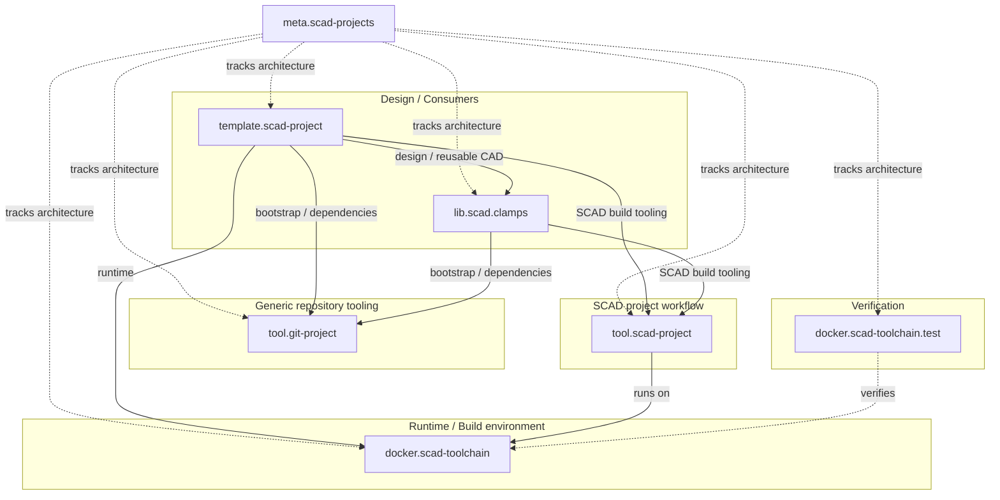

# Repository map

## Repositories

| Repository | Role | Consumes | Generated branch |
| --- | --- | --- | --- |
| `tool.git-project` | generic Git bootstrap/dependency tooling | Git | none |
| `docker.scad-toolchain` | CAD/runtime image | external packages | image tags |
| `docker.scad-toolchain.test` | runtime consumer tests | `docker.scad-toolchain` | optional reports |
| `tool.scad-project` | reusable SCAD project/build workflow | `docker.scad-toolchain` | `build` |
| `template.scad-project` | reference current-generation consumer | generic bootstrap + SCAD tool + libraries | `build` |
| `lib.scad.clamps` | reusable CAD library/current consumer | generic bootstrap + SCAD toolchain/workflow | `build` + `verification` |
| `meta.scad-projects` | current ecosystem architecture/integration | controlled repositories above as submodules | `build` |

The broader SCAD/CAD inventory is intentionally not duplicated here. Use
`tech.scad/catalog.yml` to determine which projects are classified as current or
classic infrastructure.

## Integration view



The dotted relationships are integration/coordination relationships. They do
not mean that the individual repositories depend on `meta.scad-projects`.

The arrows from consumers to `tool.git-project` describe the target ownership
boundary introduced by Step 0.5. Actual adoption is proven in each owning
repository and must not be inferred from this architecture diagram alone.

## Current dependency conventions

The repository map separates architectural relationships from a consumer's
exact dependency policy.

Target convention for current-generation consumers:

```text
tools/tool.git-project
    bootstrap engine pinned directly by the parent repository gitlink

project.yml
    generic dependency/profile policy

managed dependency gitlinks
    exact resolved commits

tools/tool.scad-project
    SCAD tooling dependency managed through the generic layer
```

SCAD-specific configuration remains owned by the SCAD layer. Step 0.5 may use a
migration-compatible form while the existing consumers move to the separated
bootstrap model.

Exact refs and commits are deliberately not copied into this architecture page.
The concrete state belongs to the owning consumer repositories and generated
status reporting.

## Migration scope

For a generic current-stack migration, consult `tech.scad/catalog.yml` and use
repositories whose project-infrastructure classification is `generation:
current` as the broad candidate set.

Do not automatically migrate:

- classic standalone CAD projects;
- classic projects using `brainboxemb.github.actions`.

A project can be migrated separately later, but that is not implied by work on
the current shared stack.

## Live/generated status

The meta workflows initialize tracked repositories at the first submodule level
only. Nested submodules inside tracked consumers are not required for the
generated repository-status view.

The static table above documents repository roles. Current commit/tag/CI state
is generated by `scripts/repository-status.py` and published on the `build`
branch as `repository-status.md`.

This separation is intentional:

```text
docs/repository-map.md
    architecture/source of truth

build/repository-status.md
    current generated state
```
