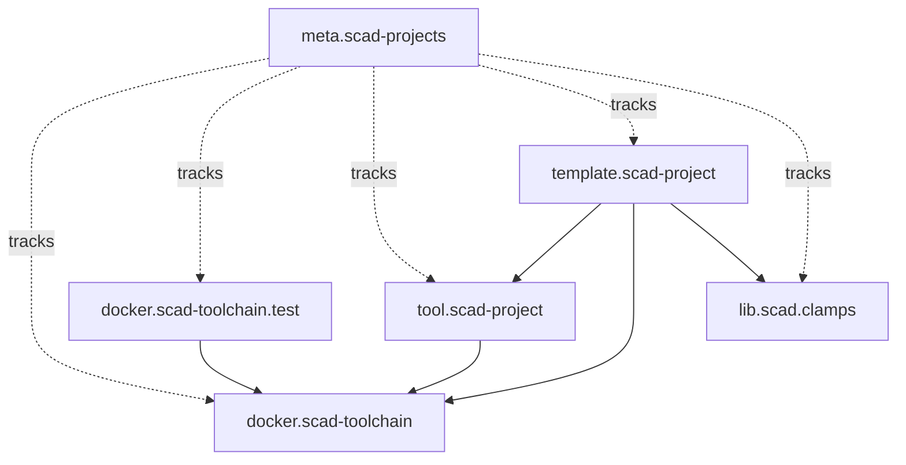

# Repository map

## Repositories

| Repository | Role | Consumes | Generated branch |
| --- | --- | --- | --- |
| `docker.scad-toolchain` | CAD/runtime image | external packages | image tags |
| `docker.scad-toolchain.test` | runtime consumer tests | `docker.scad-toolchain` | optional reports |
| `tool.scad-project` | reusable project workflow | `docker.scad-toolchain` | `build` |
| `template.scad-project` | reference consumer | toolchain, project tool, libraries | `build` |
| `lib.scad.clamps` | reusable CAD library | toolchain | `build` |
| `meta.scad-projects` | ecosystem architecture/integration | all above as submodules | `build` |

## Integration view

The dotted relationships are integration/coordination relationships. They do
not mean that the individual repositories depend on `meta.scad-projects`.
