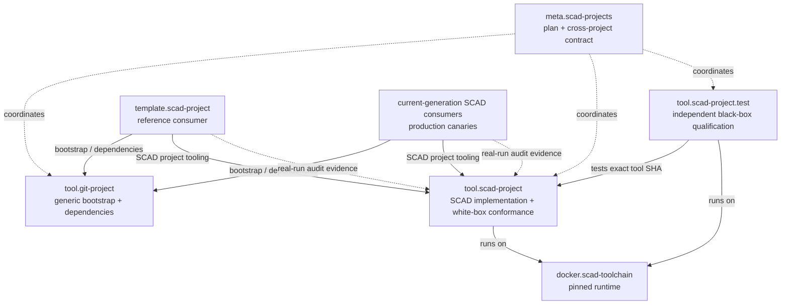

# Tooling build-decision and verification plan

## Purpose

This plan defines how the SCAD ecosystem will make selective build behavior:

1. explicitly specified;
2. deterministically testable;
3. independently integration-tested;
4. continuously observable in real project builds.

The plan is coordinated from `meta.scad-projects`, while implementation remains
in the repository that owns the behavior. Generic Git bootstrap/dependency
management belongs in `tool.git-project`; SCons/build/design/verification logic
belongs in `tool.scad-project`. The meta repository records the cross-project
contract and rollout order.

The current authoring/build mechanisms are described separately in
[project-workflow-model.md](project-workflow-model.md).

For broad SCAD/CAD migration scope, use the infrastructure-generation
classification in `tech.scad/catalog.yml`. `meta.scad-projects` coordinates a
controlled current integration set and must not assume that every CAD repository
uses the current project stack.

## Problem statement

Today we have useful selective build behavior, but several concerns are still
mixed together:

- unit tests of Python code;
- tests that inspect reusable workflow YAML;
- a small real-SCons prototype test;
- GitHub Actions cache behavior;
- production consumer builds used as practical evidence;
- build reports that only distinguish `executed` from `not_executed`.

That makes it too easy to learn expected behavior from whatever a real consumer
run happened to do. The desired order is the reverse:

```text
defined behavior
      ↓
deterministic conformance test
      ↓
independent integration test
      ↓
real-world build audit
```

Production projects should confirm a known contract, not be the place where the
contract is discovered.

## Architectural principles

### 1. The meta repository coordinates; owning repositories implement

`meta.scad-projects` owns the cross-project plan, vocabulary, dependency
relationships and rollout sequence.

Implementation and repository-local tests stay with their owner:

```text
tool.git-project
    generic repository bootstrap
    generic dependency/submodule management
    generic dependency validation/status/update

tool.scad-project
    SCAD project/build policy
    build engine
    SCons drivers
    structured reports
    deterministic decision tests
    post-build audit command

tool.scad-project.test          proposed in Step 4
    independent black-box qualification

template.scad-project
    reference consumer / canary

real current-generation SCAD consumers
    production evidence
```

Classic CAD projects are not implicitly part of current-stack migrations.

### 2. Real SCons behavior must be tested with real SCons

Mocks are useful for unit boundaries, but the decision suite must execute SCons
itself. Cache tests must use a real SCons `CacheDir` snapshot, not a fake
"cache hit" flag.

### 3. GitHub Actions caching is a separate adapter layer

SCons decides whether a target action is needed. GitHub Actions restores and
saves the filesystem cache around that process. These two behaviors need
separate tests and separate telemetry.

### 4. Machine-readable evidence is primary

Human logs remain valuable for debugging, but automated validation should use
structured JSON reports rather than parse long GitHub Actions logs.

### 5. Missed rebuilds are more severe than unnecessary rebuilds

A target incorrectly reused after an input changed is a correctness error.
An unchanged target that rebuilt unnecessarily is initially a performance /
selectivity warning. Overbuild policy can become stricter after enough real-run
data has been collected.

## Proposed test architecture



`tool.scad-project.test` is a proposed repository. It should not be added to the
current ecosystem architecture as an existing component until Step 4 creates
it.

## Plan overview

| Step | Name | Primary owner | Depends on | Initial state |
| --- | --- | --- | --- | --- |
| 0 | Baseline and vocabulary | `meta.scad-projects` | — | documented |
| 0.5 | Adopt generic Git bootstrap layer | `tool.git-project` + `tool.scad-project` + current consumers | 0 | planned prerequisite |
| 1 | Structured build-decision telemetry | `tool.scad-project` | 0.5 | paused until 0.5 |
| 2 | Deterministic SCons decision suite | `tool.scad-project` | 1 | planned |
| 3 | Post-build decision audit | `tool.scad-project` | 1, 2 | planned |
| 4 | Independent tooling test repository | `tool.scad-project.test` | 2, 3 | planned |
| 5 | Deterministic GitHub Actions cache tests | `tool.scad-project.test` + `tool.scad-project` | 4 | planned |
| 6 | Consumer rollout and continuous observation | template + selected current consumers | 3, 5 | planned |
| 7 | Authoring-model consolidation | meta + `tool.scad-project` | 2, 3, 6 | planned |
| 8 | Cleanup, policy tightening and release | ecosystem | 6, 7 | planned |

The steps are intentionally small enough that a new work session can take one
step without needing to redesign the whole system. Step 0.5 is an explicit plan
correction introduced when `tool.git-project` became the owner of generic Git
project bootstrap/dependency behavior.

---

## Step 0 — Baseline and vocabulary

### Goal

Capture the current behavior before changing it.

### Deliverables

- this roadmap;
- [project-workflow-model.md](project-workflow-model.md);
- shared vocabulary for target outcomes:
  - `BUILT`;
  - `CACHE_RESTORED`;
  - `CURRENT`;
  - `ERROR`;
- explicit distinction between:
  - per-target SCons outcome;
  - GitHub Actions cache restore result;
  - design snapshot restore result.

### Completion criterion

The current system can be discussed without using ambiguous phrases such as
"cache/current" for two different situations.

---

## Step 0.5 — Adopt generic Git bootstrap layer

### Goal

Establish the new repository ownership boundary before adding more behavior to
`tool.scad-project`.

Generic Git bootstrap, dependency registration, submodule alignment, dependency
status and generic update behavior belong to `tool.git-project`. SCAD-specific
build, design, verification, workflow and runtime behavior remains in
`tool.scad-project`.

### Owning repositories

- `tool.git-project` owns the generic bootstrap/dependency contract;
- `tool.scad-project` owns the SCAD-side migration away from its older generic
  bootstrap implementation;
- each migrated current-generation consumer owns its own configuration/gitlink
  adoption.

`meta.scad-projects` coordinates the order and evidence but does not absorb the
implementation.

### Migration scope

Use `tech.scad/catalog.yml` to determine the broad candidate set. Only
repositories classified with:

```yaml
project_infrastructure:
  generation: current
```

are candidates for this generic current-stack migration.

Do not include classic standalone or classic shared-actions CAD projects unless
a separate project-specific migration explicitly chooses to do so.

The catalog identifies the generation; each owning repository remains
authoritative for whether it has actually adopted `tool.git-project` yet.

### Required architecture changes

The current project model should converge on this responsibility split:

```text
consumer repository
    ├── tools/tool.git-project
    │       generic bootstrap engine, pinned directly by Git
    │
    ├── project.yml
    │       generic project/dependency/profile declarations
    │
    ├── project.scad.yml (or equivalent SCAD profile contract)
    │       SCAD-specific project/build configuration
    │
    └── tools/tool.scad-project
            SCAD-specific tooling dependency managed through the generic layer
```

The exact migration details may preserve compatibility while repositories move,
but new generic Git/submodule logic must not be duplicated back into
`tool.scad-project`.

### Required migration work

At minimum:

1. update `tool.scad-project` so its documented and executable bootstrap/update
   boundary uses `tool.git-project` for generic repository dependency work;
2. retain SCAD-specific responsibilities in `tool.scad-project`, including
   build/design/verification behavior and any SCAD-specific workflow alignment
   that does not belong in the generic Git tool;
3. migrate `template.scad-project` first as the reference consumer;
4. migrate current-generation libraries/consumers selected from the
   `tech.scad` catalog;
5. verify that clean bootstrap, committed-lock restore, explicit update and
   dirty-dependency protection still behave deterministically;
6. verify that SCAD Build/Verify behavior is unchanged except for the intended
   bootstrap/dependency ownership change.

### Initial rollout order

Use the current catalog rather than a hard-coded claim that all CAD projects
participate. At the time this prerequisite was introduced, the cataloged
current-generation SCAD consumers included the template, current SCAD
libraries, and the current HUB75 display-frame restart. Re-check the catalog at
execution time because this set can grow.

### Completion criterion

A clean current-generation SCAD consumer can establish its generic repository
dependencies through `tool.git-project`, use `tool.scad-project` only for
SCAD-specific project/build behavior, and pass its normal Build/Verify evidence.
The classic project generation remains unaffected.

Only after this criterion is met should Step 1 resume.

---

## Step 1 — Structured build-decision telemetry

### Status

Paused until Step 0.5 is complete. Issue/branch work may exist in
`tool.scad-project`, but it must not be treated as the active implementation
step until the bootstrap ownership migration is finished.

### Goal

Make every target decision machine-readable before adding more tests around it.

### Owning repository

`tool.scad-project`

### Required change

Replace the coarse report model:

```text
executed
not_executed
```

with explicit per-target outcomes.

A minimum report entry should be able to express:

```json
{
  "output": "bld/png/example.png",
  "outcome": "BUILT",
  "existed_before": false,
  "exists_after": true,
  "sources": [
    "dsg/openscad/render/example.scad",
    "dsg/openscad/components/shared.scad"
  ],
  "target_spec_digest": "..."
}
```

The run-level report should also record enough provenance to interpret the
decision later, including where available:

- source commit SHA;
- tool commit/version;
- toolchain version/image;
- build-engine/backend signature;
- cache namespace/key information supplied by the workflow;
- target count and counts per outcome;
- manifest/schema version.

### Outcome classification

Before SCons starts, record whether each output exists. After SCons completes,
combine that with the target action execution log:

```text
action executed
    -> BUILT

action not executed
output absent before
output present after
    -> CACHE_RESTORED

action not executed
output present before and after
    -> CURRENT

action not executed
output absent after
    -> ERROR
```

The implementation must test edge cases rather than assume the above is always
sufficient, but this is the intended observable contract.

### Scope

Apply the same outcome vocabulary to:

- normal build targets;
- design targets;
- verification targets.

Their report files may remain separate, but their schema should be compatible.

### Completion criterion

A build artifact can tell, target by target, whether work was built, restored
from SCons cache, already current, or invalid — without parsing console text.

---

## Step 2 — Deterministic SCons decision suite

### Goal

Turn the existing real-SCons prototype into a defined conformance matrix.

### Owning repository

`tool.scad-project`

### Fixture model

Use a deliberately tiny synthetic dependency graph, for example:

```text
shared.scad
   ├── a.scad + private-a.scad -> A.out
   └── b.scad + private-b.scad -> B.out
```

The builder should be fast and deterministic. It does not need to invoke
OpenSCAD; the purpose is to test SCons dependency and cache decisions.

### Required scenarios

| Scenario | Expected result |
| --- | --- |
| cold workspace + empty CacheDir | A and B `BUILT` |
| second identical run in same workspace | A and B `CURRENT` |
| change `private-a.scad` | A `BUILT`, B `CURRENT` |
| change `shared.scad` | A and B `BUILT` |
| change only A target specification/profile | A `BUILT`, B unchanged |
| change backend/tool signature | affected targets rebuild according to contract |
| delete A output but keep valid local state | deterministic repair/rebuild behavior is asserted |
| fresh workspace/state + populated CacheDir | A and B `CACHE_RESTORED`, builder executes 0 times |
| CacheDir contains only A | A restored, B built |
| corrupt/unusable cache entry | safe rebuild/failure behavior, never silent invalid reuse |
| add a new target C | only required new/affected work occurs |
| remove a target | removed target is not treated as an active target |
| build cache populated, verification cache empty | verification does not silently consume writable build cache as its own cache |
| verification cache populated, build cache empty | build/verification cache ownership remains isolated |

The suite should also cover dependency scanning constructs actually supported by
`tool.scad-project`, including the relevant OpenSCAD `include`/`use` forms.

### Cache simulation rule

The test must model a fresh CI runner explicitly:

1. run the fixture and populate SCons `CacheDir`;
2. copy/archive the cache snapshot;
3. create a fresh workspace with no outputs and no previous `.sconsign` state;
4. restore only the cache snapshot;
5. run SCons again;
6. assert target outcomes and builder invocation count.

This tests SCons cache behavior without involving GitHub Actions.

### Completion criterion

For every supported selective-build rule there is a scenario with a fixed
input mutation and an exact expected target-decision set.

---

## Step 3 — Post-build decision audit

### Goal

Verify after every real build that actual target decisions are compatible with
the inputs that changed.

### Owning repository

`tool.scad-project`

### Proposed command

A command such as:

```text
scad-project build-audit
```

or an equivalent stable CLI name.

The exact command name is an implementation decision for this step.

### Inputs

The audit should use structured data, not scrape the human log. It should have
access to:

- the target/dependency manifest;
- the structured decision report from Step 1;
- changed files between a defined base and source revision when running in Git;
- target specification changes;
- cache restore context supplied by the workflow.

### Core comparison

```text
which targets should have been affected?
                ↓
which outcomes actually occurred?
```

### Initial classification policy

| Situation | Initial severity |
| --- | --- |
| changed dependency -> affected target `BUILT` | OK |
| changed dependency -> affected target incorrectly `CURRENT` | ERROR |
| changed dependency -> stale target incorrectly restored | ERROR |
| unchanged target -> `CURRENT` | OK |
| unchanged target on fresh runner -> `CACHE_RESTORED` | OK |
| unchanged target -> unnecessary `BUILT` | WARNING initially |
| cold/no-cache context -> impossible `CACHE_RESTORED` | ERROR |
| declared target missing after build | ERROR |

A target may legitimately rebuild for causes other than a source-file diff,
such as target-specification or backend-signature changes. The audit must model
those causes explicitly rather than label every such rebuild as overbuild.

### Outputs

Produce both:

- machine-readable audit JSON;
- concise GitHub Step Summary text.

Example summary:

```text
Build decision audit

Changed inputs              3
Expected affected targets   8

Actual
  Built                     8
  Restored from cache      17
  Already current           7

Unexpected rebuilds         0
Unexpected reuse            0

Decision audit              PASS
```

### Completion criterion

A real project build can fail automatically when it reuses a target that should
have been invalidated, while unnecessary rebuilds are surfaced separately.

---

## Step 4 — Independent `tool.scad-project.test` repository

### Goal

Add an external black-box qualification layer for `tool.scad-project` similar
in intent to `docker.scad-toolchain.test` for the runtime image.

### Proposed repository

```text
brainboxemb/tool.scad-project.test
```

The repository name is proposed by this plan and should only become part of the
current architecture once the repository actually exists.

### Key rule

The test harness must not prove the reusable workflow by depending entirely on
that same reusable workflow.

It should instead:

- accept or pin an exact `tool.scad-project` commit/ref under test;
- use a small stable fixture project;
- call the tooling directly for black-box tests;
- run in a pinned/defined toolchain environment;
- keep its harness intentionally small;
- pin third-party Actions to exact SHAs where practical for the qualification
  workflow.

### What belongs here

- CLI-level build and verification qualification;
- fixed synthetic consumer fixtures;
- test of packaged/repository behavior from outside the tool repository;
- later GitHub Actions cache-adapter tests from Step 5.

### What does not belong here

- implementation-unit tests of internal Python functions;
- another copy of the tool's dependency algorithm;
- consumer-specific CAD geometry.

### Completion criterion

An exact tool SHA can be qualified from an independent repository without using
real CAD projects as the test harness.

---

## Step 5 — Deterministic GitHub Actions cache tests

### Goal

Test the GitHub Actions cache adapter separately from the SCons decision engine.

### Owning repositories

Primarily `tool.scad-project.test`, with workflow changes in
`tool.scad-project` when needed.

### Why this is separate

The Step 2 cache simulation proves what SCons does when a CacheDir is present.
It does not prove that GitHub Actions restores and saves the intended cache
paths and key namespaces.

### Required Actions-level scenarios

Use a controlled workflow with per-run unique cache keys so tests do not depend
on historical repository cache state.

At minimum exercise:

```text
job A
    create known cache payload
    save unique base key

job B
    restore exact key
    assert exact-hit semantics

job C
    request related new key + explicit restore prefix
    assert fallback-hit semantics and payload

job D
    request unrelated unique key
    assert cold miss
```

Then run the tool against the restored cache and assert that the structured
per-target outcomes agree with the expected SCons behavior.

Also verify cache ownership boundaries between:

- normal selective build cache;
- verification selective cache;
- generated design snapshot cache.

### Completion criterion

Cache exact-hit, fallback-hit and miss behavior are reproducible in a fixed
integration workflow and correlated with target-level decision evidence.

---

## Step 6 — Consumer rollout and continuous observation

### Goal

Use real projects as canaries only after the behavior is defined and tested.

### Rollout order

Start with:

1. `template.scad-project`;
2. one representative library/verification consumer;
3. one representative larger CAD consumer such as the HUB75 display frame;
4. wider current-generation consumers after the reports are stable.

Use `tech.scad/catalog.yml` to determine which repositories belong to the
current generation; this step does not imply rollout to classic CAD projects.

### Per-build evidence

Build and Verify should publish the relevant structured reports as artifacts and
summarize:

- changed inputs;
- expected affected targets;
- `BUILT` count;
- `CACHE_RESTORED` count;
- `CURRENT` count;
- unexpected rebuilds;
- unexpected reuse;
- cache restore class;
- audit result.

### Practice analysis

The first rollout period should preserve warnings for unnecessary rebuilds and
collect examples. The purpose is to find legitimate invalidation causes missing
from the model before making overbuilds fatal.

Missed required rebuilds remain failures from the start.

### Completion criterion

Real builds are no longer manually interpreted from long logs to answer "why
did this rebuild?"; the run publishes that decision evidence directly.

---

## Step 7 — Authoring-model consolidation

### Goal

Revisit the current mixture of render/export directories, `design.md` render
directives and verification entrypoints only after execution behavior is
stable.

### Starting point

The current mechanisms are documented in
[project-workflow-model.md](project-workflow-model.md):

1. normal render/export directories;
2. design-file render declarations;
3. verification render/export directories;
4. verification commands/scripts.

### Design question

The goal is not necessarily one user-facing syntax. The target architecture to
evaluate is one canonical **internal target specification** produced by several
domain-appropriate front ends:

```text
normal render/export declarations ─┐
                                   │
design.md render declarations ─────┼─> TargetSpec
                                   │
verification declarations ─────────┘
                                          ↓
                                  same dependency model
                                          ↓
                                  same decision schema
```

Questions to answer in this step:

- Can normal and verification directory discovery use the same target compiler
  with only different output/cache scopes?
- Should `render.yml` / `export.yml` become the common profile language wherever
  files are explicit entrypoints?
- Which design-specific fields genuinely belong embedded in `design.md`?
- Can generated design entrypoints compile to the same internal `TargetSpec`?
- Can project-specific verification scripts stop rendering targets that the
  generic verification target model can own?
- Are there targets currently declared twice through a directory and a script?
- Can output naming, variants, watermarking and dependency reporting use one
  shared schema?

### Important constraint

Do not simplify authoring by reducing verification quality or making design
narrative harder to maintain. Internal convergence is more important than
forcing identical source syntax where the domains differ.

### Completion criterion

The ecosystem has a documented target declaration model with clear reasons for
any remaining differences between normal build, design generation and
verification.

---

## Step 8 — Cleanup, policy tightening and release

### Goal

Turn the proven model into normal ecosystem policy.

### Work

- remove superseded prototype tests;
- remove duplicated target orchestration discovered in Step 7;
- update template/reference documentation;
- update meta architecture if `tool.scad-project.test` now exists;
- decide whether unnecessary rebuilds become CI failures or remain warnings;
- version/release the resulting tooling contract;
- update tracked ecosystem pins through normal reviewed dependency updates.

### Completion criterion

The defined behavior, tests, workflow adapters, audit output and authoring model
are all represented in released tooling and reference consumers.

## How to use this plan in a new chat/work session

A new session should start from the meta repository as the coordination source
and verify that the selected step still matches the current architecture before
implementation. The canonical copy/paste handoff is maintained in
[new-chat-handoff.md](new-chat-handoff.md).

At minimum read:

```text
docs/architecture.md
docs/repository-map.md
docs/project-workflow-model.md
docs/tooling-test-plan.md
```

For a broad CAD/SCAD migration, use `tech.scad/catalog.yml` to determine the
infrastructure-generation scope rather than assuming every CAD repository uses
the current stack.

If a new repository or changed ownership boundary introduces a prerequisite,
document and execute that prerequisite before continuing the previously selected
step. Do not infer architecture only from prior chat history.

## Per-step completion discipline

A step should not be marked complete merely because code exists.

For implementation steps, completion should normally mean:

- implementation PR is reviewed/accepted;
- tests for the exact implementation head are green;
- required structured evidence has been inspected;
- behavior/documentation matches the contract in this plan;
- the meta plan is updated with the resulting repository/PR/release evidence
  where useful.

The meta repository should record stable cross-project conclusions, not copy
all volatile CI details from the owning repositories.
