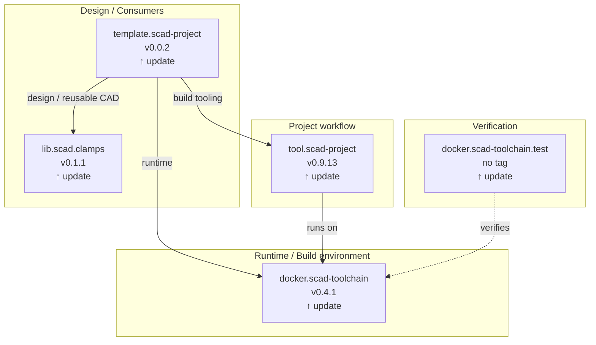

# SCAD ecosystem repository status

Generated: **2026-09-13 06:53 UTC**

This report compares the commits pinned by `meta.scad-projects` with
the current default branches of the tracked repositories.

| Repository | Role | Pinned | Default branch | Latest | Latest tag | Sync | Actions | Last commit |
| --- | --- | --- | --- | --- | --- | --- | --- | --- |
| [`tool.git-project`](https://github.com/brainboxemb/tool.git-project) | Generic Git bootstrap and dependency tooling | `5db2b23b` | `main` | `5db2b23b` | `-` | **up to date** | [success](https://github.com/brainboxemb/tool.git-project/actions/runs/34694967033) | 2026-09-12T14:54:42+02:00 |
| [`docker.scad-toolchain`](https://github.com/brainboxemb/docker.scad-toolchain) | Runtime / build environment | `a02b10e1` | `main` | `ce940e07` | `v0.4.1` | **update available** | [success](https://github.com/brainboxemb/docker.scad-toolchain/actions/runs/34570014148) | 2026-09-11T08:36:44+02:00 |
| [`docker.scad-toolchain.test`](https://github.com/brainboxemb/docker.scad-toolchain.test) | Verification of the runtime/toolchain | `174b1605` | `main` | `5b11cd38` | `-` | **update available** | [success](https://github.com/brainboxemb/docker.scad-toolchain.test/actions/runs/34570694755) | 2026-09-11T08:37:00+02:00 |
| [`tool.scad-project`](https://github.com/brainboxemb/tool.scad-project) | Reusable SCAD project and build tooling | `0a5e281e` | `main` | `19f38a6c` | `v0.9.13` | **update available** | [success](https://github.com/brainboxemb/tool.scad-project/actions/runs/34626711180) | 2026-09-11T19:14:58+02:00 |
| [`template.scad-project`](https://github.com/brainboxemb/template.scad-project) | Reference consumer project | `246fa924` | `main` | `a6b37508` | `v0.0.2` | **update available** | [success](https://github.com/brainboxemb/template.scad-project/actions/runs/34628177107) | 2026-09-11T19:31:32+02:00 |
| [`lib.scad.clamps`](https://github.com/brainboxemb/lib.scad.clamps) | Reusable CAD library | `595765d5` | `main` | `1b1366ba` | `v0.1.1` | **update available** | [success](https://github.com/brainboxemb/lib.scad.clamps/actions/runs/34601243698) | 2026-09-11T14:53:02+02:00 |

## Versioned architecture view

### Relationship meaning

- `template.scad-project -> tool.scad-project`: build tooling
- `template.scad-project -> docker.scad-toolchain`: runtime
- `template.scad-project -> lib.scad.clamps`: design / reusable CAD
- `tool.scad-project -> docker.scad-toolchain`: runs on
- `docker.scad-toolchain.test -.-> docker.scad-toolchain`: verifies

The architecture itself is documented in `docs/architecture.md`; this
page is the generated current-state view.
